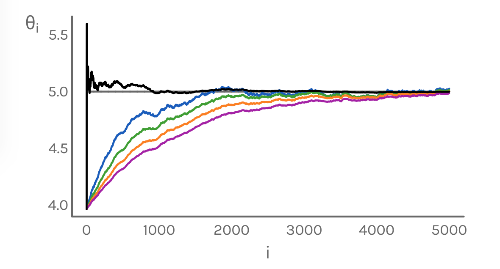

[](http://quantlet.de/)

## [](http://quantlet.de/) **TXTsgd** [](http://quantlet.de/)

```yaml

Name of QuantLet : TXTsgd

Published in : TXT

Description : 'Optimizes least squares loss function via stochastic gradient descent. The results
of each iteration are plotted for different choices of eta. eta = 1/i (black), eta = 1/1000 (blue),
eta = 1/1500 (green), eta = 1/2000 (orange), eta = 1/2500 (purple)'

Keywords : 'plot, visualization, simulation, normal, optimization, iterative, mean, least-squares,
loss function'

Keywords[new] : stochastic gradient descent

See also : 'TXTfpbsupervised, TXTfpblexical, TXTBreweries, TXTSimulation, TXTSimulationAttention,
TXTnlp, TXTMcDbl, TXTMcDlm'

Author : Elisabeth Bommes

Submitted : Tue, September 6 2016 by Elisabeth Bommes

```




### R Code:
```r
# install and load packages
libraries = c("devtools",  
              "showtext")

lapply(libraries, function(x) if (!(x %in% installed.packages())) {
    install.packages(x, repos = "http://cran.uni-muenster.de/")
})

# install ebmisc
library(devtools)
if (!("ebmisc" %in% installed.packages())) {
    devtools::install_github("ebommes/ebmisc")
}

lapply(c(libraries, "ebmisc"), require, character.only = TRUE)

# add font
font.add.google("Karla", "karla")
showtext.auto()

# initialize
n     = 5000
mu    = 5 
sigma = 1

eta_1 = 1/1000
eta_2 = 1/1500
eta_3 = 1/2000
eta_4 = 1/2500
const = rep(mu, n)

# generate random values
set.seed(123)
x     = rnorm(n, mu, sigma)
t     = sample(1:n, n, replace = FALSE)

# initialize theta vectors
theta_1   = c(x[t[1]], rep(0, length(x) - 1))
theta_2   = c(x[t[1]], rep(0, length(x) - 1))
theta_3   = c(x[t[1]], rep(0, length(x) - 1))
theta_4   = c(x[t[1]], rep(0, length(x) - 1))
theta_opt = c(x[t[1]], rep(0, length(x) - 1))

# optimize theta as estimator for mean via SGD
for(i in 2:n){
    eta_opt  = 0.5 * (1 / i)
    theta_opt[i] = theta_opt[i - 1] - (2 * eta_opt * (theta_opt[i - 1] - x[t[i]]))
    theta_1[i]   = theta_1[i - 1] - (2 * eta_1 * (theta_1[i - 1] - x[t[i]]))
    theta_2[i]   = theta_2[i - 1] - (2 * eta_2 * (theta_2[i - 1] - x[t[i]]))
    theta_3[i]   = theta_3[i - 1] - (2 * eta_3 * (theta_3[i - 1] - x[t[i]]))
    theta_4[i]   = theta_4[i - 1] - (2 * eta_4 * (theta_4[i - 1] - x[t[i]]))
}

# plot
dev.new(width = 5.5, height = 3)
par(mar = c(3, 4.1, 1, 2.1))

plot(theta_opt,
     lwd  = 2, 
     col  = "black",
     bty  = 'l',
     xaxt = "n",
     yaxt = "n",
     xlab = "",
     ylab = "",
     type = "l",
     xlim = c(0, n),
     ylim = c(min(theta_1, theta_2, theta_3, theta_4, theta_opt), 
              max(theta_1, theta_2, theta_3, theta_4, theta_opt)))

lines(const, lty = 1, lwd = 2, col = colorme("grey"),
       xlim = c(1, n))
lines(theta_1, lwd = 2, col = "#1959BE")
lines(theta_2, lwd = 2, col = colorme("green"))
lines(theta_3, lwd = 2, col = colorme("orange"))
lines(theta_4, lwd = 2, col = colorme("pink"))
lines(theta_opt, lwd = 2, col = "black")

box(lwd = 2, bty  = 'l', col = colorme("grey"))

mtext(expression(theta[i]), 
      side = 2,
      line = 1.8, 
      cex  = 1.2, 
      col  = colorme("grey"),
      las  = 1,
      at   = max(theta_1, theta_2, theta_3, theta_4, theta_opt))

mtext("i", 
      side   = 1,
      line   = 1.5, 
      cex    = 1.2, 
      col    = colorme("grey"),
      family = "karla",
      las = 1)


axis(side     = 1, 
     tick     = FALSE, 
     cex.lab  = 1.5, 
     line     = -0.8, 
     col.axis = colorme("grey"),
     family   = "karla",
     las      = 1)

axis(side     = 2, 
     tick     = FALSE, 
     cex.lab  = 1.5, 
     line     = -0.8, 
     col.axis = colorme("grey"),
     family   = "karla",
     las      = 1)

```
